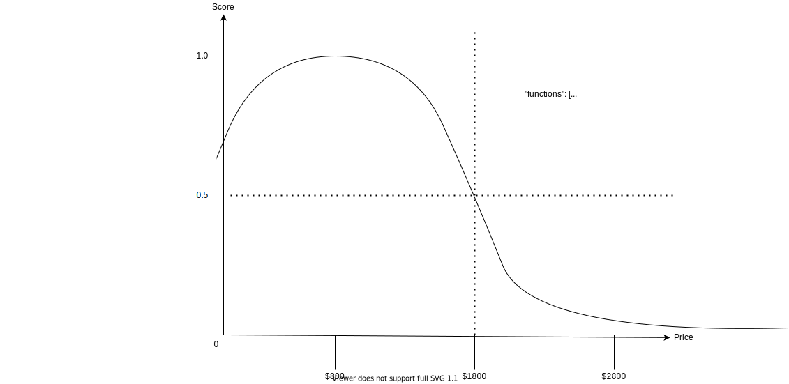

# Decay scoring

## Linear decay

```json
{
  "query": {
    "function_score": {
      "query": {
        "match_all": {}
      },
      "functions": [
        {
          "linear": {
            "price": {
              "origin": 800,
              "scale": 1000,
              "decay": 0.5
            }
          }
        }
      ]
    }
  }
}
```


## Gaussian decay

```json
{
  "query": {
    "function_score": {
      "query": {
        "match_all": {}
      },
      "functions": [
        {
          "gauss": {
            "price": {
              "origin": 800,
              "scale": 1000,
              "decay": 0.5
            }
          }
        }
      ]
    }
  }
}
```


