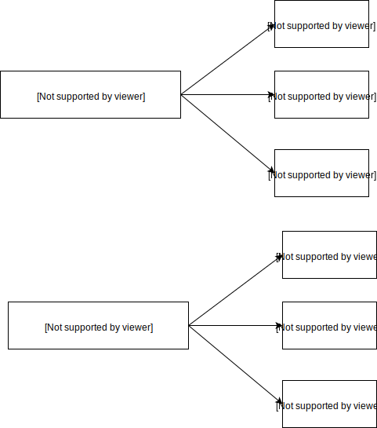
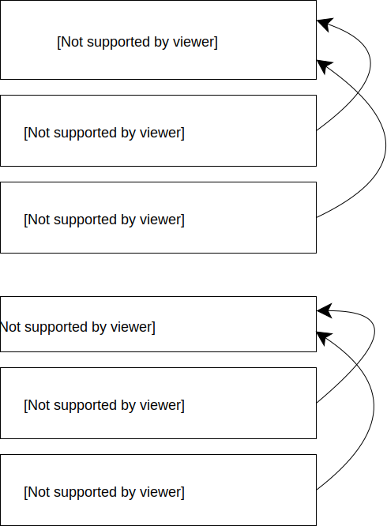

# Representing relationships

How could you represent that a real estate agency can have many real estate agents?

Let's assume that an agent only works for one agency.



## Nested array of objects

Note: you will need to explicitly declare `agents` as being of type `nested`, and will have to use `nested` queries.

```json 
{
  "name": "Nelson Alexander"
  "address": "528 Sydney Rd Brunswick Vic",
  "agents": [
    {
      "name": "Mary Smith",
      "phone": "0411 11112222"
    },
    {
      "name": "Joe Blogs",
      "phone": "0411 33334444"
    }
  ]
}
```

## Parent / Child

Agents represented as separate documents but mixed together in the same index as the agencies.
Special "join"  field is used to connect them.



## Field Collapsing

De-normalise the relationship.
e.g. duplicate the agency information in every agent document.

```json lines
{"agentId": 1, "agencyId": 123, "agencyName": "Nelson ..", "agencyAddress": "52 Syd..", "agentName":  "M Smith", "agentPhone":  "0411 11112222"}
{"agentId": 2, "agencyId": 123, "agencyName": "Nelson ..", "agencyAddress": "52 Syd..", "agentName":  "J BLogs", "agentPhone":  "0411 33334444"}
{"agentId": 3, "agencyId": 456, "agencyName": "MacGrath", "agencyAddress": "16 Car..", "agentName":  "J Ng", "agentPhone":  "0411 12121212"}
{"agentId": 4, "agencyId": 456, "agencyName": "MacGrath", "agencyAddress": "16 Car..", "agentName":  "J Ryan", "agentPhone":  "0411 34343434"}
```

Query can "collapse" results on a field (e.g. the `agencyId`).
