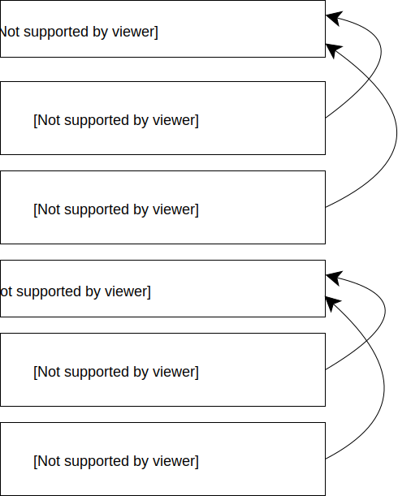

# Representing relationships

Consider listing upgrades.

Which listings had a premiere upgrade on April 1st?


## Nested array of objects

Note: you will need to explicitly declare `upgrade` as being of type `nested`, and will have to use `nested` queries.

```json 
{
  "address": "1 Smith St Melbourne Vic 3000",
  "upgrade": [
    {
      "product": "premier",
      "start": "2015-03-07",
      "end": "2015-03-21"
    },
    {
      "product": "highlight",
      "start": "2015-03-22",
      "end": "2015-04-13"
    }
  ]
}
```

## Parent / Child

Upgrades represented as separate documents but mixed together in the same index as the listings.
Special "join"  field is used to connect them.



## Field Collapsing

De-normalise the relationship.
e.g. duplicate the listing information in every document.

```json
{"listingId": 1, "address": "5 Smith St", "product": "premier", "start": "2015-03-07", "end": "2015-03-21"}
{"listingId": 1, "address": "5 Smith St", "product": "highlight", "start": "2015-03-22", "end": "2015-04-13"}
{"listingId": 2, "address": "7 Jones St", "product": "premier", "start": "2015-03-28", "end": "2015-04-10"}
{"listingId": 2, "address": "7 Jones St", "product": "highlight", "start": "2015-04-11", "end": "2015-05-19"}
```

Query can "collapse" results on a field (e.g. the `listingId`).
