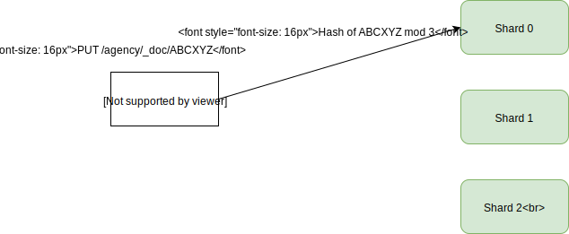
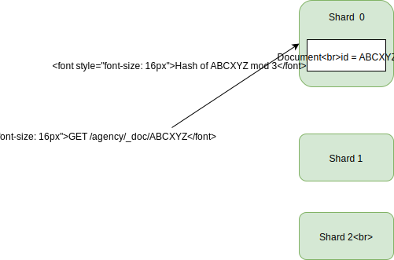
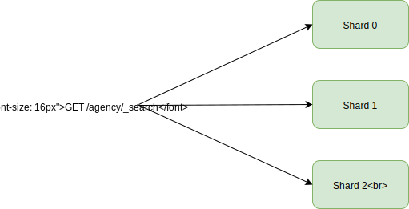
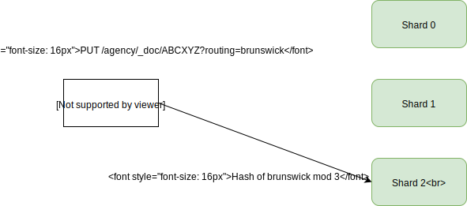
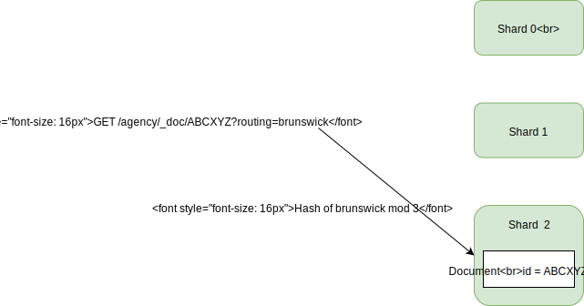

# Routing

## Default Routing

### Insert
When a document is inserted, by default it is _routed_ to a shard based on a hash of its document id.

```
PUT /agency/_doc/ABCXYZ
{
  "name": "Nelson Alexander"
}
```



### Get by Id
When fetching a document, the same hashing is used so the fetch can be directed to the correct shard.

```
GET /agency/_doc/ABCXYZ
```



### Search
Searches are forwarded to all shards

```
GET /agency/_search
```



## Explicit Routing

You can over-ride the routing by specifying a _routing_ parameter when you save the document.

Suppose you want all agency documents belonging to the same suburb to be co-located in the same shard,
then you could use the suburb name as the routing parameter

### Insert

```
PUT /agency/_doc/ABCXYZ?routing=brunswick
{
  "name": "Nelson Alexander"
}
```



### Get by Id

You **must** specify the routing parameter when fetching the document.

```
GET /agency/_doc/ABCXYZ?routing=brunswick
```



### Search

By default, it will still forward the search to all shards.

But, you **may** specify the routing parameter when searching (not mandatory).

```
GET /agency/_search?routing=brunswick
{
  "query": {
    "term": {
      "suburb": {
        "value": "brunswick"
      }
    }
  }
}
```

NOTE: `GET /agency/_search?routing=brunswick` **does not limit the query to "brunswick" documents**.
It will return all documents in the same shard as the "brunswick" documents.


This can potentially increase your throughput (searches per second).
